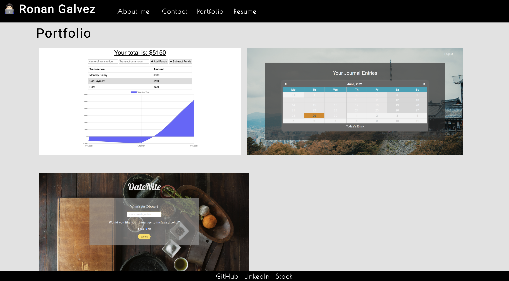

# Ronan Galvez [](http://unlicense.org/)

## Description
This is a portfolio to showcase for future employers and collaborators. 

## Table of Contents
1. [Description](#description)
2. [Technologies](#Technologies)
3. [Screenshots](#Screenshots)
4. [Deployed](#Deployed)
4. [Author](#Author)

## Technologies
```
HTML | CSS | Bootstrap | JavaScript | CRA | React
```

## Screenshots 


## Deployed 
[Portfolio Link](https://ronan-codes.github.io/react-portfolio/)

## Author
* This application was written and developed by Ronan Galvez as part of the UCF Coding Bootcamp.
* For any inquiries/suggestions/concerns, open an issue in the [project repo](https://github.com/Ronan-Codes/react-portfolio.git) or contact me directly at [galv.ronan@gmail.com](galv.ronan@gmail.com).
* Check out the rest of my work on GitHub at [Ronan-Codes](https://github.com/Ronan-Codes).